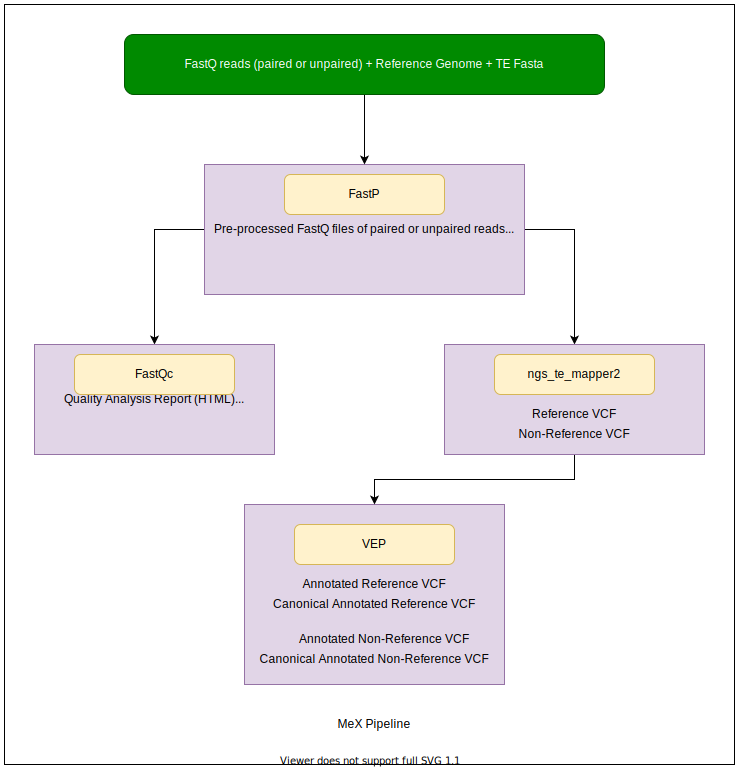

# MeX Pipeline
A pipeline for identification and annotation of transposable element (TE) insertions using next generation sequencing (NGS) data.



### Pre-requisites
1. Conda (<a href="https://docs.conda.io/en/latest/miniconda.html">Miniconda</a> or <a href="https://www.anaconda.com/products/individual">Anaconda</a>)
2. Linux
3. Git

### Getting Started
Creating conda environment
```bash
git clone https://github.com/RawalTeam/MeX-Pipeline.git
cd  Mex-Pipeline
conda env create -f envs/mex.yaml --name mex
```

Installing additional external dependencies
```bash
conda activate mex
python install_deps.py --processes 2 --assembly GRCh38 --cachedir ~/.vep
```

```commandline
usage: install_deps.py [-h] [-p PROCESSES] [-a ASSEMBLY] [-d CACHEDIR]
                       [-oa ONLY_ASSEMBLY]

optional arguments:
  -h, --help            show this help message and exit
  -p PROCESSES, --processes PROCESSES
                        Number of processes used (default: 2)
  -a ASSEMBLY, --assembly ASSEMBLY
                        Genome assembly ex., GRCh38, GRCh37, and other. See
                        VEP docs (https://www.ensembl.org/info/docs/tools/vep
                        /script/vep_other.html#assembly) (default: GRCh38)
  -d CACHEDIR, --cachedir CACHEDIR
                        VEP Data directory (default: /home/dell/.vep)
  -oa ONLY_ASSEMBLY, --only-assembly ONLY_ASSEMBLY
                        Download Genome assembly ex., GRCh38, GRCh37, and
                        other. See VEP docs (https://www.ensembl.org/info/doc
                        s/tools/vep/script/vep_other.html#assembly) in
                        existing VEP cache directory. Requires config.json in
                        installation directory (default: None)

```

Adding new human genome assembly into existing VEP cache
```bash
python install_deps.py --only-assembly GRCh37
```
- Require config.json in installation directory which was created in above step automatically.

Running MeX Pipeline
```bash
conda activate mex
python mex.py --fq1 path/of/fastq1 --genome path/of/fasta --te path/of/fasta --outdir path/of/output_folder -p 2
```

Help
```bash
conda activate mex
python mex.py -h
```
```commandline
usage: mex.py -1 FQ1 -g GENOME -te TE -O OUTDIR [-h] [-2 FQ2] [-p PROCESSES]
              [--force] [--annotation ANNOTATION] [--window WINDOW]
              [--min_mapq MIN_MAPQ] [--min_af MIN_AF] [--tsd_max TSD_MAX]
              [--gap_max GAP_MAX] [--keep_files] [--assembly ASSEMBLY]

required arguments:
  -1 FQ1, --fq1 FQ1     FASTQ Read 1 (default: None)
  -g GENOME, --genome GENOME
                        Genome FASTA (default: None)
  -te TE, --te TE       TE FASTA (default: None)
  -O OUTDIR, --outdir OUTDIR
                        Output Directory (default: None)

optional arguments:
  -h, --help            show this help message and exit
  -2 FQ2, --fq2 FQ2     FASTQ Read 2 (default: None)
  -p PROCESSES, --processes PROCESSES
                        Number of processes for multiprocessing (default: 2)
  --force               Rerun entire MeX pipeline (default: False)

ngs_te_mapper2 arguments:
  https://github.com/bergmanlab/ngs_te_mapper2#command-line-help-page

  --annotation ANNOTATION
                        reference TE annotation in GFF3 format (must have
                        'Target' attribute in the 9th column) (default: None)
  --window WINDOW       merge window for identifying TE clusters (default: 10)
  --min_mapq MIN_MAPQ   minimum mapping quality of alignment (default: 20)
  --min_af MIN_AF       minimum allele frequency (default: 0.1)
  --tsd_max TSD_MAX     maximum TSD size (default: 25)
  --gap_max GAP_MAX     maximum gap size (default: 5)
  --keep_files          If provided then all ngs_te_mapper2 intermediate files
                        will be kept (default: False)

Ensembl Variant Effect Predictor (VEP) arguments:
  https://asia.ensembl.org/info/docs/tools/vep/script/vep_options.html#basic

  --assembly ASSEMBLY   Genome assembly ex., GRCh38, GRCh37, and other. See
                        VEP docs (https://www.ensembl.org/info/docs/tools/vep/
                        script/vep_other.html#assembly) (default: GRCh38)

```

### Components of MeX Pipeline
* <a href="https://github.com/OpenGene/fastp">FASTp</a>\
A tool designed to provide fast all-in-one preprocessing for FastQ files. This tool is developed in C++ with a multithreading supported to afford high performance.

* <a href="https://github.com/s-andrews/FastQC">FASTQc</a>\
FastQC is a program designed to spot potential problems in high througput sequencing datasets. It runs a set of analyses on one or more raw sequence files in fastq or bam format and produces a report which summarises the results.

* <a href="https://github.com/bergmanlab/ngs_te_mapper2">ngs_te_mapper2</a>\
ngs_te_mapper2 is a re-implementation of the method for detecting transposable element (TE) insertions from next-generation sequencing (NGS) data originally described in Linheiro and Bergman (2012) PLoS ONE 7(2): e30008. ngs_te_mapper2 uses a three-stage procedure to annotate non-reference TEs as the span of target site duplication (TSD), following the framework described in Bergman (2012) Mob Genet Elements. 2:51-54.
  
* <a href="https://www.ensembl.org/vep">Ensembl Variant Effect Predictor (VEP)</a>\
VEP determines the effect of your variants (SNPs, insertions, deletions, CNVs or structural variants) on genes, transcripts, and protein sequence, as well as regulatory regions.

### Inputs
#### Required
1. FASTq file 1 (--fq1, -1)\
Either the Read1 FASTQ file from a paired-end sequencing, or the FASTQ file from an unpaired sequencing.
   
2. Genome FASTA file (--genome, -g)\
The genome sequence of the reference genome in FASTA format.

3. TE FASTA file (--te, -te)\
A FASTA file containing a consensus sequence for each family.
   
#### Optional
1. FASTq file 2 (--fq2, -2)\
The Read2 FASTQ file from a paired-end sequencing run.
   
### Outputs
    --- /path/of/outdir
        |_ logs* (various log files)
        |_ outputs
            |_ fastp*
            |_ fastqc*
            |_ ngs_te_mapper2*
            |_ vep*
        |_ config.json (internal configuration file)
        |_ Snakefile (snakemake file)
        |_ workflow.html (snakemake report)
    
    * Is a directory